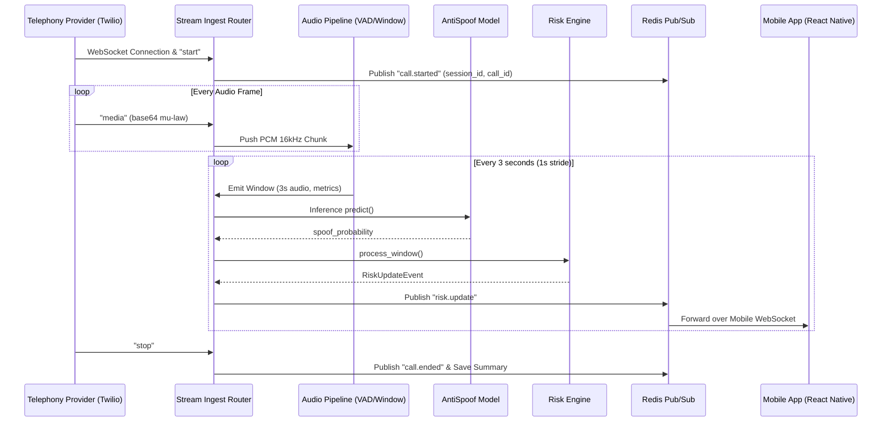

# VoiceGuard Architecture

## System Overview
VoiceGuard is a real-time voice monitoring and anti-spoofing security layer. 
It does **NOT** act as a replacement calling application or secretly capture arbitrary cellular phone calls.
Instead, it sits alongside a programmable voice/SIP provider that routes the caller-side audio stream to the VoiceGuard backend for analysis, while the mobile application provides a real-time dashboard of call security.

## Core Components

### 1. Programmable Voice / SIP Provider
Routes the audio. Connects the Caller to the Receiver, and simultaneously forks the authorized caller-side audio stream to the VoiceGuard backend.

### 2. VoiceGuard Backend
- **Framework:** Python, FastAPI
- **Realtime:** WebSockets for bidirectional communication with the mobile application.
- **Cache/State:** Redis for fast rolling risk accumulation and active call state.
- **Database:** PostgreSQL (via Supabase) for user data, settings, call history, and trusted voice embeddings.
- **AI/ML Engine:** PyTorch
  - **Audio Processing:** Normalization, Voice Activity Detection (VAD), and Speech Windowing.
  - **Anti-Spoofing:** AASIST-family baseline models to detect synthetic or spoofed voices.
  - **Speaker Verification:** ECAPA-TDNN (planned) for trusted speaker verification.

### 3. VoiceGuard Mobile Application
- **Framework:** React Native, Expo, TypeScript.
- **State Management:** Zustand (live state), TanStack Query (API state).
- **Function:** Serves as the user's security dashboard, providing real-time alerts, rolling risk visualization, anti-spoof signals, and post-call history.

## Data Flow (Active Call)

1. **Call Initiation:**
   - Caller dials Receiver via the SIP Provider.
   - Provider forks the audio stream to the VoiceGuard Backend.
2. **Backend Analysis:**
   - Backend receives audio chunks.
   - VAD identifies speech segments.
   - Anti-spoof model analyzes speech for synthetic artifacts.
   - Rolling risk engine calculates real-time risk scores.
3. **Mobile Real-time Updates:**
   - Backend pushes risk scores and anti-spoof signals via WebSockets to the active Mobile Application.
   - Mobile app displays visual signals to the user (e.g., safe, warning, danger).
4. **Action/Alert:**
   - If risk exceeds a threshold, secondary verification workflows or security alerts are triggered on the mobile app.

### End-to-End Pipeline Data Flow

## Security & Privacy
- Audio streams are processed in-memory and not stored persistently unless specifically configured for debugging/enrollment with user consent.
- Communication between backend and mobile uses secure WebSockets (WSS) and HTTPS.
- Authentication and authorization strictly restrict call data to the authorized receiver.
