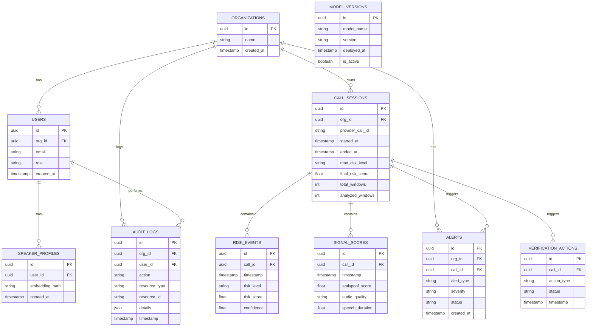

# VoiceGuard Database Schema

VoiceGuard uses PostgreSQL (via Supabase) as its primary persistent storage mechanism. The backend interfaces with the database using **SQLAlchemy** (asynchronous) and uses **Alembic** for schema migrations.

## ER Diagram

## Core Tables

1. **`organizations`** & **`users`**: Tenant isolation boundaries. All resources strictly belong to an organization.
2. **`call_sessions`**: The master record for a phone call. It stores the lifecycle of the call, including total analyzed AI windows and the highest aggregated risk level over the duration of the call.
3. **`risk_events`**: High-frequency telemetry. Every time the Risk Engine produces a state (e.g., every 3 seconds), an event is persisted here.
4. **`signal_scores`**: Raw model inferences (Anti-Spoofing, Audio Quality) used for debugging and analytics.
5. **`alerts`**: Aggregated security alerts generated by persistent high-risk conditions. These are fetched by the mobile app.
6. **`verification_actions`**: Records secondary verification flows (e.g. out-of-band push notifications or knowledge query prompts).
7. **`speaker_profiles`**: Metadata pointing to trusted speaker audio embeddings (stored in cloud storage).
8. **`model_versions`**: Tracking for AI deployments to ensure auditing of which model flagged a specific call.
9. **`audit_logs`**: Immutable ledger of administrative and security-relevant actions within an organization.
